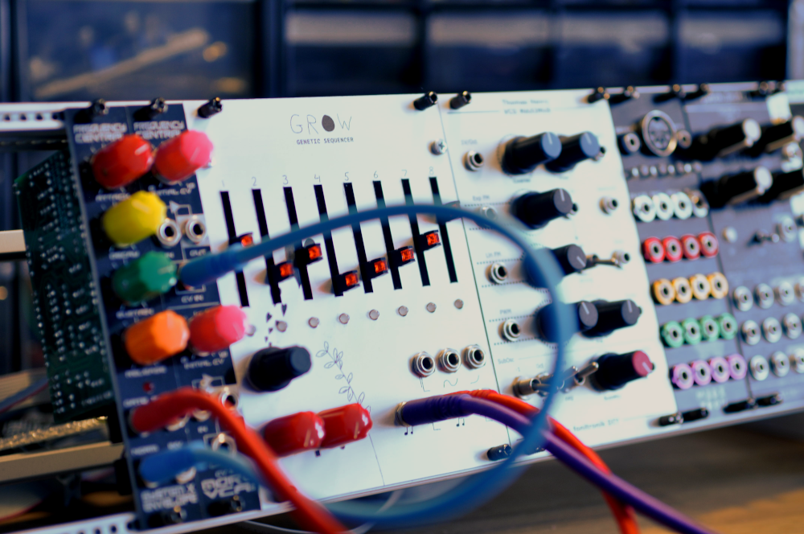

# GROW

A Eurorack genetic sequencer.



This repository serves as the home for its MCU code and hardware schematics.

There will be a lot more info soon.

## To build

```sh
git submodule update --init --recursive # if not cloned recursively
brew install cmake
brew install --cask gcc-arm-embedded
mkdir build && cd build
cmake -DCMAKE_TOOLCHAIN_FILE=../arm-none-eabi-gcc.cmake ..
make
```

## LICENSE

GNU General Public License v3.0

